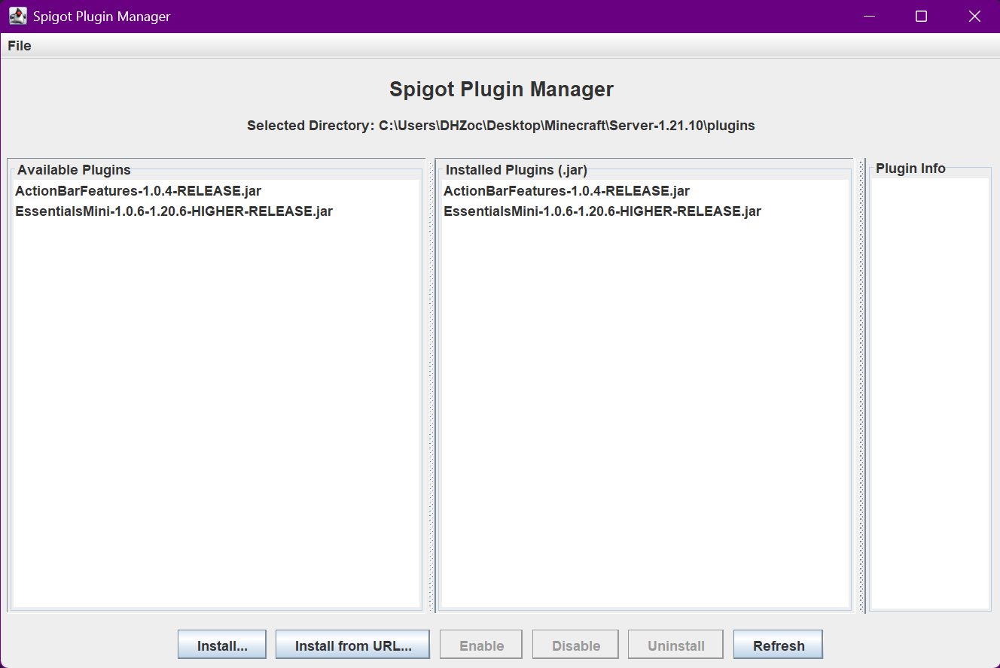
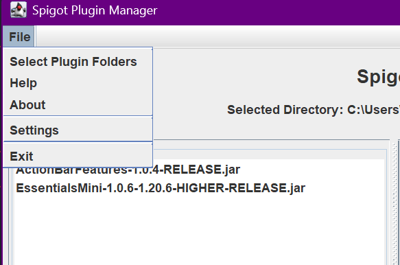
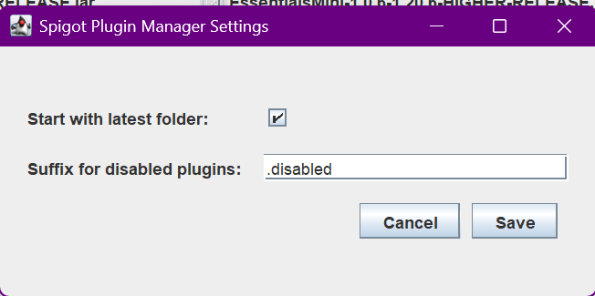

# Spigot Plugin Manager

A simple Spigot plugin manager to help you manage your Spigot server plugins easily.  
This project uses the Java Swing framework for the GUI (Desktop Environment required).

## Features

- **Install plugins** from local files or URLs
- **Uninstall plugins** with a single click
- **Enable or disable plugins** by renaming them with a configurable suffix
- **Customizable settings** for plugin management
- **User-friendly graphical interface**
- **Display Plugin Information** such as name, version, description, authors and more.

## Requirements

- Java 21 or higher
- Spigot server version 1.16 or higher (local installation)
- Internet connection for downloading plugins from URLs

## Installation

1. Download the latest version from the [releases page](https://github.com/frame-dev/SpigotPluginManager/releases).
2. Run the application with `java -jar SpigotPluginManager-1.2-SNAPSHOT.jar`
3. Select your Spigot server's `plugins` folder from the **File** menu.
4. Manage your plugins using the provided buttons.

## Usage

1. **Select Plugin Folder**: Go to `File > Select Plugin Folders` and choose your server's `plugins` directory.
2. **Install**: Click `Install...` to add a plugin from your local disk, or `Install from URL...` to download one.
3. **Enable/Disable**: Select a plugin and click `Enable` or `Disable` to toggle its state.
4. **Uninstall**: Select an installed plugin and click `Uninstall` to remove it.
5. **Refresh**: Click `Refresh` to reload the plugin lists.

## Settings

Access settings via `File > Settings`:

| Option | Description |
|--------|-------------|
| Start with latest folder | Automatically load the last selected plugin directory on startup |
| Suffix for disabled plugins | The file extension used for disabled plugins (default: `.disabled`) |

## Building from Source

1. Clone the repository: `git clone https://github.com/frame-dev/SpigotPluginManager.git`
2. Navigate to the directory: `cd SpigotPluginManager`
3. Build with Maven: `mvn clean package`
4. The built JAR will be in the `target` directory.

## Screenshots

## License

This project is open source. See the [LICENSE](LICENSE) file for details.

## Author

Developed by [FrameDev](https://github.com/frame-dev)